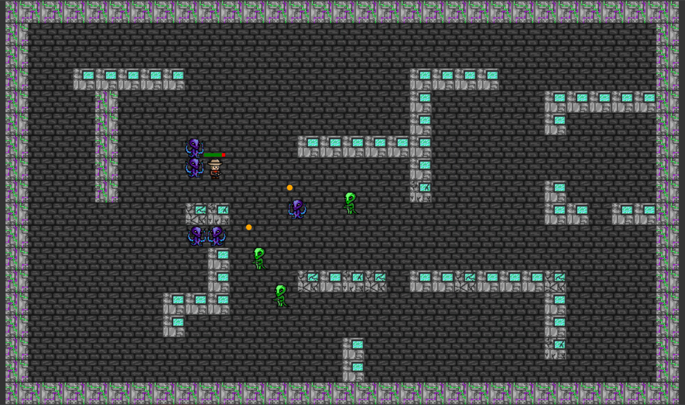
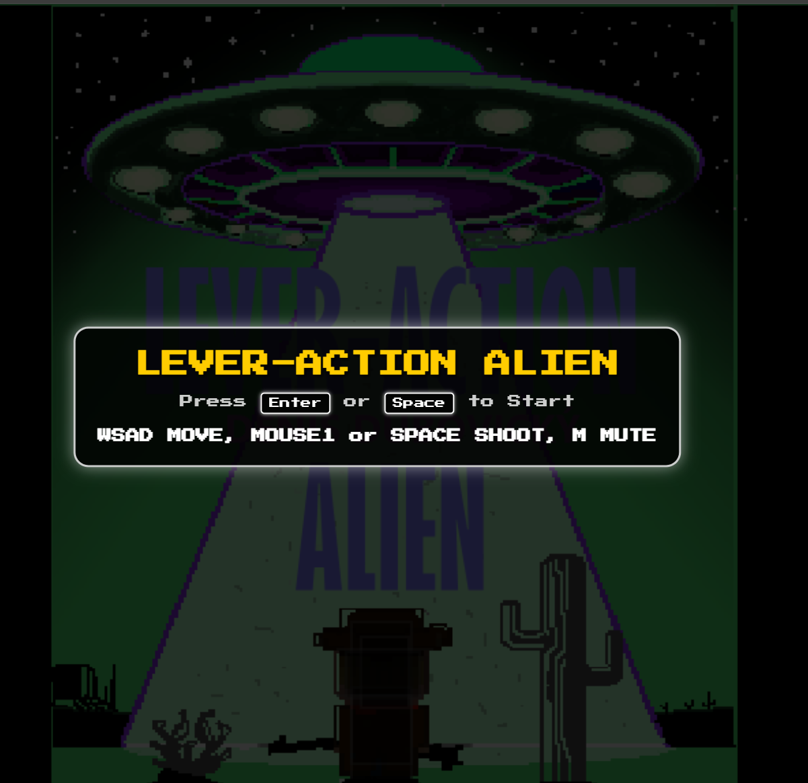
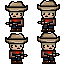
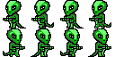
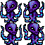

# 🎮 **LEVER-ACTION ALIEN**

Lever-Action Alien is a retro-inspired top-down shooter in cowboys vs aliens theme where you navigate pixelated environments, dodge enemy attacks, and blast your way through waves of quirky aliens. Take control of cowboy outlaw and defeat different kinds of extraterestrial enemies to save the frontier.
---

## 🌐 **Play the Game**
[Click here to play the game!](https://duboned.github.io/ccl1/)

---

## 📸 **Screenshots**

### Main Gameplay:

  
  
*Figure 1: Example of gameplay in action.*

---

### Menu and UI:

  
  
*Figure 2: Menu and user interface.*

---

## 🎨 **Spritesheets**
Below are the sprites used to create characters and objects in the game:

### Player Character:

  
  
*Figure 3: Player character animations.*

---

### Enemies and NPCs:

  
  
*Figure 4: Enemy animations.*

---

### Enemies and NPCs:

  
  
*Figure 4: Enemy animations.*

---
### Enemies and NPCs:

  
  
*Figure 4: Enemy animations.*

---

## ✍️ **Reflection**

### What went well:
- **Creative Design:** The theme and style came together seamlessly, and the sprites were fun to design.
- **Core Mechanics:** The gravity-based gameplay worked better than expected and provided a unique challenge.

### Challenges:
- **Time Constraints:** Implementing all the features we envisioned wasn’t possible due to the limited timeframe.
- **Bug Fixes:** Handling collisions and edge cases for gravity mechanics was tricky.

### Lessons Learned:
- **Prototyping Matters:** Testing early prototypes helped refine the core mechanics quickly.
- **Keep it Simple:** Focusing on one unique mechanic instead of multiple features made the game more polished.
